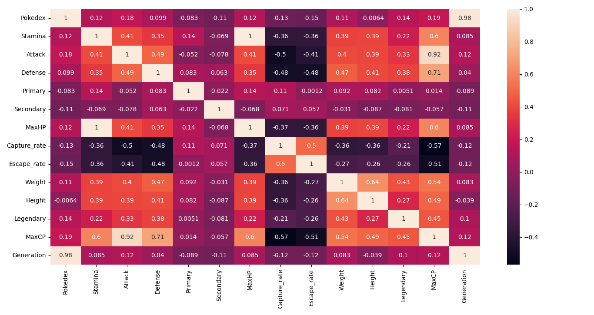

# Data Mining Final Project - 07
## Pokemon Dataset

Source:[https://www.kaggle.com/netzuel/pokmon-go-dataset-15-generations](https://www.kaggle.com/netzuel/pokmon-go-dataset-15-generations)

## Data Preprocessing
決定取用的feature前，先身對features進行correlation的分析，由於`Primary`、`Secondary`和`Lengendary`的類型皆為string，因此使用以下function轉換為數字的表示法:

```python
# Convert string attributes to categorical attributes
df['Primary'] = df['Primary'].astype('category').cat.codes
df['Secondary'] = df['Secondary'].astype('category').cat.codes
df['Legendary'] = df['Legendary'].astype('category').cat.codes
```
接著使用seanborn的heatmap畫出correlation matrix:
```python
corr_matrix = df.corr()
sn.heatmap(corr_matrix, annot=True)
plt.show()
```
### Correlation Matrix

|              | Pokedex              | Stamina             | Attack              | Defense            | Primary              | Secondary           | MaxHP               | Capture_rate       | Escape_rate          | Weight              | Height               | Legendary           | MaxCP               | Generation          |
|--------------|----------------------|---------------------|---------------------|--------------------|----------------------|---------------------|---------------------|--------------------|----------------------|---------------------|----------------------|---------------------|---------------------|---------------------|
| Pokedex      | 1                    | 0.120523548479466   | 0.175620222114892   | 0.0987283370902873 | -0.0827392350857954  | -0.113946144274367  | 0.120753366457777   | -0.133526117199533 | -0.146794939881267   | 0.114777440603754   | -0.00637489858438165 | 0.141434011172702   | 0.185218811990232   | 0.977452991502954   |
| Stamina      | 0.120523548479466    | 1                   | 0.409916648709368   | 0.348467165654773  | 0.137479353656819    | -0.0685576656437342 | 0.99996854349348    | -0.364982083821885 | -0.361631592100465   | 0.386327788138495   | 0.391513637387034    | 0.223790389993134   | 0.60058162284215    | 0.0850941862196952  |
| Attack       | 0.175620222114892    | 0.409916648709368   | 1                   | 0.487407614642419  | -0.052025778426539   | -0.0782686834614212 | 0.409391757199128   | -0.501927412575266 | -0.410828833333153   | 0.401871517806077   | 0.394972991214527    | 0.332385521403667   | 0.923270827728863   | 0.122374110004443   |
| Defense      | 0.0987283370902873   | 0.348467165654773   | 0.487407614642419   | 1                  | 0.0830145234810126   | 0.0632354622390862  | 0.348522259808728   | -0.484783675498336 | -0.482166081896042   | 0.472485133030148   | 0.405105591835481    | 0.384257609680547   | 0.708355560973073   | 0.0404764951237791  |
| Primary      | -0.0827392350857954  | 0.137479353656819   | -0.052025778426539  | 0.0830145234810126 | 1                    | -0.0222685625844072 | 0.137426650148651   | 0.110998007267998  | -0.00122046448794102 | 0.0924562217861077  | 0.0818672159585654   | 0.00509493700855675 | 0.0136951975396291  | -0.0885185055139187 |
| Secondary    | -0.113946144274367   | -0.0685576656437342 | -0.0782686834614212 | 0.0632354622390862 | -0.0222685625844072  | 1                   | -0.0683366467210663 | 0.0705518401014275 | 0.0574516412811908   | -0.0309347870993126 | -0.0872552515532235  | -0.0808202078839337 | -0.0569506361013429 | -0.108362132743075  |
| MaxHP        | 0.120753366457777    | 0.99996854349348    | 0.409391757199128   | 0.348522259808728  | 0.137426650148651    | -0.0683366467210663 | 1                   | -0.365300375581313 | -0.36192293567865    | 0.386662424720671   | 0.391624193312466    | 0.224283341546061   | 0.600253904202552   | 0.08529390605767    |
| Capture_rate | -0.133526117199533   | -0.364982083821885  | -0.501927412575266  | -0.484783675498336 | 0.110998007267998    | 0.0705518401014275  | -0.365300375581313  | 1                  | 0.499510208466353    | -0.362569630685781  | -0.355134673595774   | -0.211956610357204  | -0.569315434066781  | -0.119957141064652  |
| Escape_rate  | -0.146794939881267   | -0.361631592100465  | -0.410828833333153  | -0.482166081896042 | -0.00122046448794102 | 0.0574516412811908  | -0.36192293567865   | 0.499510208466353  | 1                    | -0.269525023095457  | -0.25577780559174    | -0.261289297124386  | -0.506864719477773  | -0.117181951437937  |
| Weight       | 0.114777440603754    | 0.386327788138495   | 0.401871517806077   | 0.472485133030148  | 0.0924562217861077   | -0.0309347870993126 | 0.386662424720671   | -0.362569630685781 | -0.269525023095457   | 1                   | 0.637847268944309    | 0.426227427968951   | 0.540115889103117   | 0.0825060203123727  |
| Height       | -0.00637489858438165 | 0.391513637387034   | 0.394972991214527   | 0.405105591835481  | 0.0818672159585654   | -0.0872552515532235 | 0.391624193312466   | -0.355134673595774 | -0.25577780559174    | 0.637847268944309   | 1                    | 0.27270954578733    | 0.487338550976867   | -0.0393734849541566 |
| Legendary    | 0.141434011172702    | 0.223790389993134   | 0.332385521403667   | 0.384257609680547  | 0.00509493700855675  | -0.0808202078839337 | 0.224283341546061   | -0.211956610357204 | -0.261289297124386   | 0.426227427968951   | 0.27270954578733     | 1                   | 0.445100191010456   | 0.0996369581928592  |
| MaxCP        | 0.185218811990232    | 0.60058162284215    | 0.923270827728863   | 0.708355560973073  | 0.0136951975396291   | -0.0569506361013429 | 0.600253904202552   | -0.569315434066781 | -0.506864719477773   | 0.540115889103117   | 0.487338550976867    | 0.445100191010456   | 1                   | 0.122806297568225   |
| Generation   | 0.977452991502954    | 0.0850941862196952  | 0.122374110004443   | 0.0404764951237791 | -0.0885185055139187  | -0.108362132743075  | 0.08529390605767    | -0.119957141064652 | -0.117181951437937   | 0.0825060203123727  | -0.0393734849541566  | 0.0996369581928592  | 0.122806297568225   | 1                   |

### Heatmap


---

## Target

```python
df["Capture_rate"].unique()
df["Escape_rate"].unique()
```


```
19 unique Values in Capture_rate:[0.2   0.1   0.05  0.5   0.25  0.125 0.3   0.6   0.15  0.4   0.7   0.03   0.06  1.    0.    0.02  0.9   0.01  0.175]
13 unique Values in Escape_rate:[0.1  0.07 0.05 0.2  0.09 0.06 0.15 0.99 0.   0.12 0.08 0.04 0.01]
```

