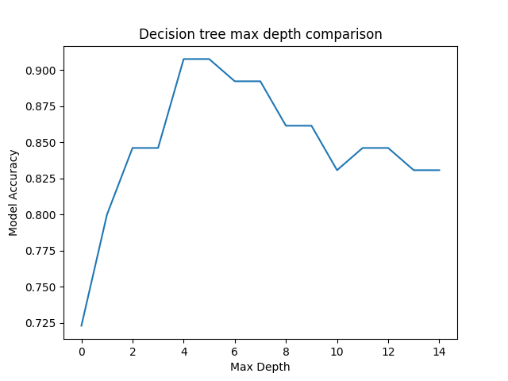
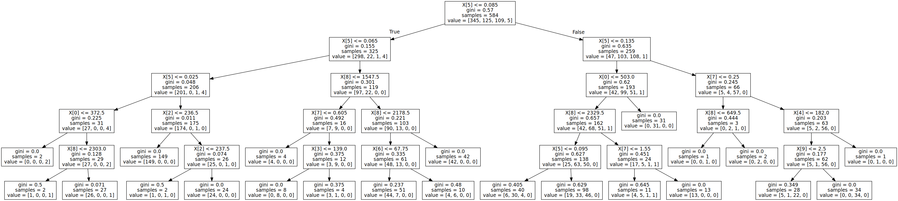

## Data Mining Personal Report
> 陳子新 第七組

## 1.專題實作目的
本專題使用Pokemon GO的資料集，其中包含了649隻Pokemon的各種feature(Attack, Defense, MaxHP...等等)，我們希望能透過Data Mining的方法，讓Model可以學到feature間的關聯，並且能幫預測出該Pokemon是否容易抓到(Capture Rate)，此外，由於`Capture_rate`本身的數值是連續的，因此我們藉由discretization的方式切成了4個區間

## 2.採用Data Mining模組
> 本專題主要使用**sklearn**的Data Mining模組

前處理的部份因為`Capture_rate`需要Discretization，因此使用了KBinsDiscretizer:
```python
from sklearn.preprocessing import KBinsDiscretizer
```

而演算法則使用Decision Tree模組:
```python
from sklearn.tree import DecisionTreeClassifier
```
## 3.程式/環境設定,執行方式說明
- 測試環境
  - ArcoLinux (Kernel=5.16)
  - Python 3.10.1
- python套件
  - sklearn 0.0
  - pandas 1.3.5
  - matplotlib 3.5.1
  - seaborn 0.11.2
- 執行方式:在terminal輸入`python main.py`即可執行

## 4.改變控制參數/技術說明
在前處理時，KBinsDiscretizer的`strategy`設定為`uniform`，也就是**equal width**的方式
```python
disc = KBinsDiscretizer(n_bins=4, encode='ordinal', strategy='uniform')
```

在Decision Tree中，為了必免產生的tree過度複雜而overfitting，因此將`max_depth`限制為5


```python
clf = DecisionTreeClassifier(criterion='gini', max_depth=5)
```

## 5.評估方法
一開始先從原始data中抽出10%當作testing data，再將剩下的分成比例為8:2的training data和validation data
```python
train_X, test_X, train_y, test_y = train_test_split(X, y, test_size = 0.2)
```
利用accuracy作為評估方法,validation data的score和自己比較，testing data的score和組員的model比較
```python
accuracy = clf.score(test_X, test_y)
```
## 6.結果及討論
在本次實作中發現，原本想要把我們要預測的`Capture_rate`作equal frequency的discretization，但實驗後發現equal width得到的分數遠遠高於equal frequency，有可能是因為我們的資料分佈不是常態分佈，因此equal width比較能表示原本的資料分佈
```python
# Accuracy when using equal width
0.9076923076923077
# Accuracy when using equal frequency
0.6
```

而在Decision Tree中，也發現若將`max_depth`設限制，不但沒有造成失準，甚至能比沒有限制的效果更好，應該是能避免掉overfitting的問題，以下為使用testing data時，不同`max_depth`下的accuracy,可以看到`max_depth`在大概5的時候效果最好:


以下為`max_depth=5`的Decision Tree的決策過程：



